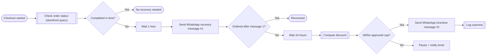

# Automation Design — Nova Home Goods — Abandoned Cart Recovery (synthetic test)

Date: 2026/08/18 · Designer: automation-architecture (test run)

> Diagram-first. Plain language everywhere except database/API-key handling.

## 1. Architecture Diagram

Trigger (stadium), external-system touchpoints (double-border: storefront query,
discount computation, outcome log), plain-language actions, branches after message
1 and after the cap check. Extends cleanly — a future message #3 or a different
channel attaches after node K without redrawing the rest.

**Node M/N added 2026-08-18** (resolving the flag originally left open here):
auto-send stays fully automatic for every normal run under the cap; only a
computed discount that would *exceed* the cap pauses the flow and notifies Amer,
rather than either silently clamping it or gating every single send on manual
approval.

## 2. Why
Client's stated pain point (client-intelligence package): 68% cart abandonment,
$38,250/day raw exposure (never a promised recovery — see business-analysis's
scenario for why). This flow targets the "profit increased" gold bar directly:
recovering some fraction of abandoned checkouts without discounting immediately
(delay avoids feeling pushy, per Amer's stated constraint) and without an unbounded
discount (capped, per Amer's stated constraint).

## 3. Database / Credentials / API Keys
- **Storefront platform API**: read access to checkout/cart status. Auth: API key,
  held as an environment credential in n8n, never in this document.
- **WhatsApp Business API**: send access for the two recovery messages. Auth:
  access token, same credential-store handling.
- **Discount-cap config**: a single pre-set value (e.g. a fixed % or $ cap) Amer
  sets once — **not a real API key**, but still a business-sensitive number, stored
  as an n8n credential/variable rather than hardcoded in the workflow.
- **Outcome log**: written to a data table (or existing helpdesk tool, TBD — see
  Dependencies) for future ROI measurement, closing the "just a feeling" gap
  client-intelligence flagged.

## 4. Dependencies
- Storefront platform must expose a checkout-started event or a pollable
  cart-status query — not confirmed which; assumed a query-based check per the
  diagram (Node B) since the client-intelligence package didn't confirm webhook
  support. **ASSUMED, Low confidence** — flagged in §25-equivalent below.
- WhatsApp Business API access for Nova (may already exist, given they use IG/FB/
  WhatsApp per their stated channel stack — not confirmed for this specific use).
- Amer sets the discount cap value before this goes live.

## 5. Risks
| Risk | Category | Severity | Mitigation |
| --- | --- | --- | --- |
| Storefront platform has no clean checkout-abandonment signal (webhook or query) | Technical | Medium | Confirm with Nova before committing to this exact trigger shape |
| Message #2's discount cap set too high, eroding margin on recovered orders | Financial | Medium | Cap is a single config value Amer approves once, not per-message — see flag below on whether that satisfies the "human approval" element |
| Customer receives message #2 after having already abandoned intentionally (price sensitivity, changed mind) — feels like spam | Adoption/reputation | Low-Medium | Two-message cap, not indefinite follow-up; stop sequence on any response |
| WhatsApp Business API rate/cost scaling with the ~850/day abandoned-cart volume | Vendor | Medium | Size against the $60-80/mo estimate from business-analysis; may run higher at this volume (same flag business-analysis's e-commerce scenario raised) |

## 6. Cost
Technical-design-side estimate only — `business-analysis` owns the rigorous number.
Ongoing: WhatsApp API usage at ~850 outbound-eligible carts/day (before the "already
ordered" branch removes many), likely toward the higher end of the $60-80/mo range
business-analysis flagged for this client's volume.

## 7. Effort
Using `time-orchestration`'s baselines: **Build 10h** (mid-range — two-branch flow,
one external query, one config-driven discount step, one log write), **Research 2h**
(confirming the storefront's actual checkout-event support — the dependency flagged
above), **Admin 1h**. Total **~13h**, ASSUMED/Low confidence on the Research portion
specifically, since the storefront's webhook support isn't confirmed.

## 8. Non-negotiable elements checklist
- [x] Error handling — storefront query failure: log and retry, don't silently drop the cart from recovery
- [x] Retry logic — WhatsApp send failures get a backoff retry; a dead-letter log entry after repeated failure, not a silent drop
- [x] Logging — Node L logs outcome (recovered / not) for future ROI measurement
- [x] Human approval points — auto-send under the pre-approved discount cap; pause
  + notify Amer if a computed discount would exceed it (node M/N above)
- [x] Credential handling — all three credentials (storefront, WhatsApp, discount cap) referenced, never hardcoded

---

## Flag — resolved 2026-08-18
Resolved: auto-send stays fully automatic under the pre-approved cap; a computed
discount that would exceed it pauses the flow and notifies Amer instead of sending
or silently clamping. Added to the diagram (nodes M/N) and folded into
`../SKILL.md` § Non-negotiable design elements as the general rule for any
recurring automated action bounded by a pre-approved cap.
